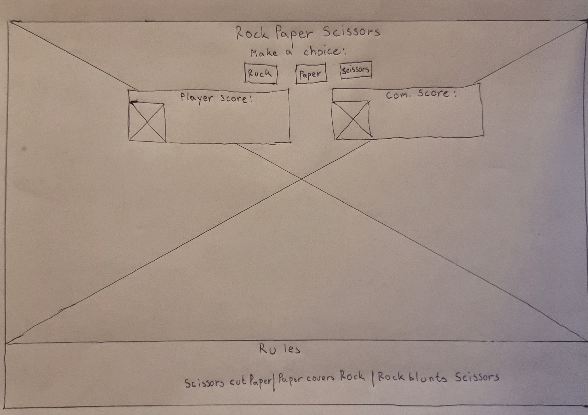
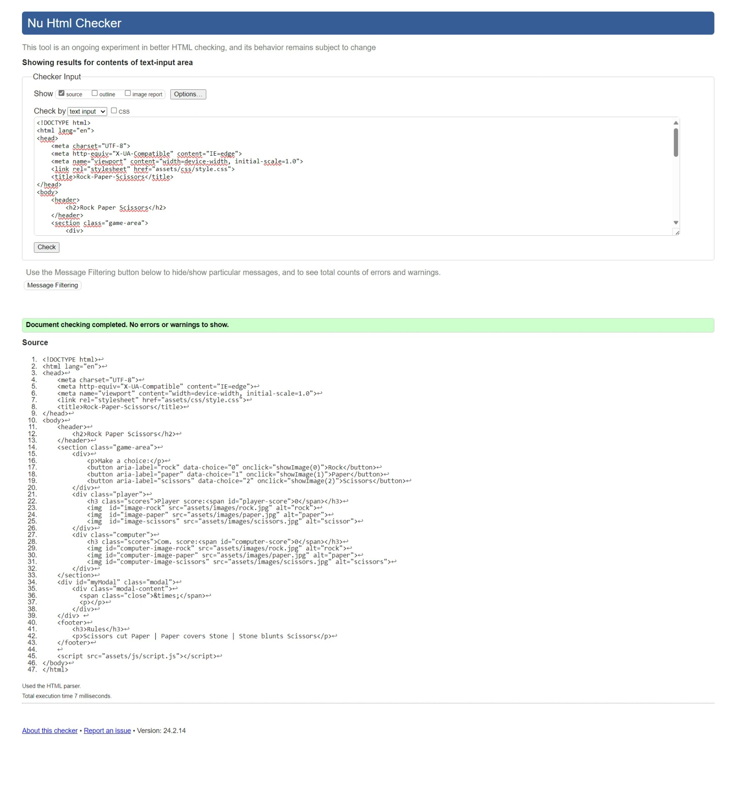
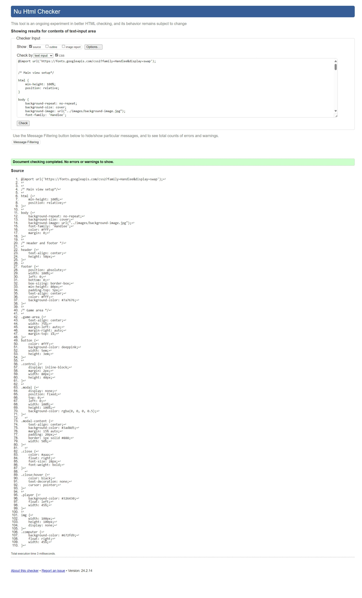
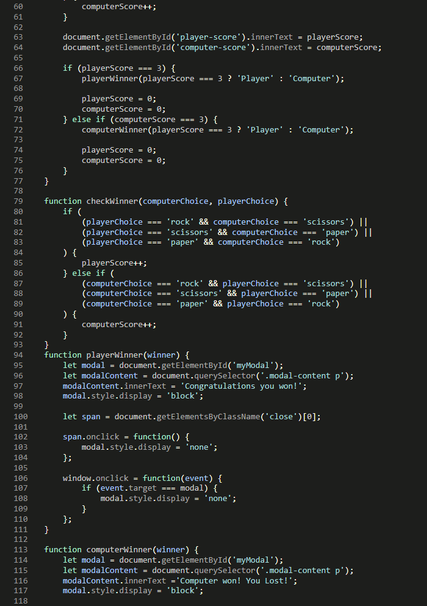
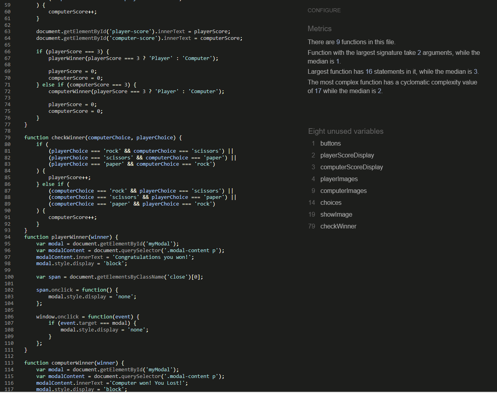
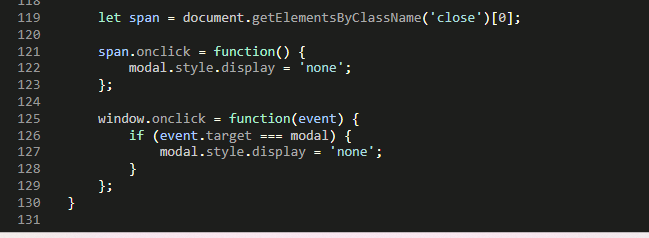
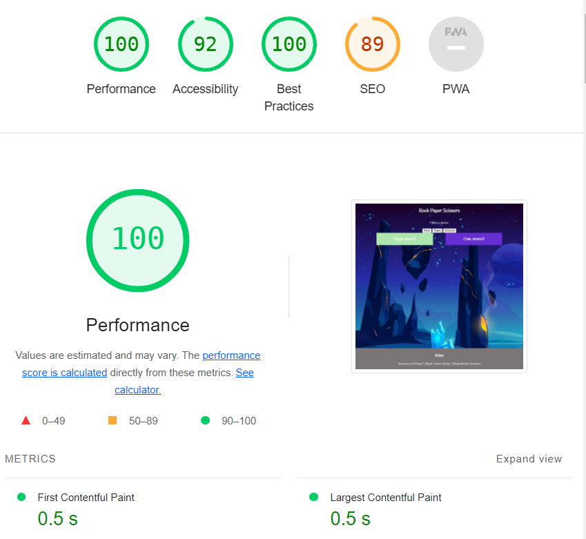
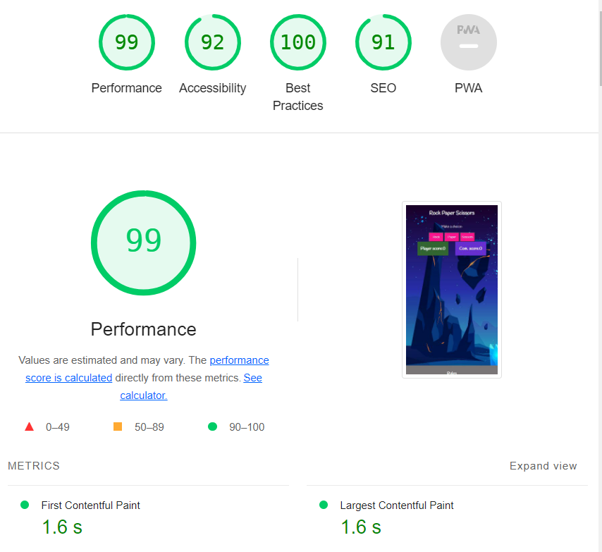

# Rock-Paper-Scisssor Game:

[My live project](https://blackcatten.github.io/Rock-Paper-Scissor/)
## User Experience (UX):

### User Stories:
The user should be able to:

1. Read what the game is called.
2. Choose between 3 buttons.
3. Read the rules at the bottom of the footer.
4. Check which buttons belong to which image.

## Features: 

### Existing Features:

## Typography:

## Design:

### Color:

### Wireframe:
Desktop homepage

Ipad homepage

Mobile homepage

## Testing:
1. Validator index.html-pass:

2. Validator CSS-pass: 

3. Validator Javascript-pass:

4. Lighthouse:
 

### User Story Testing:

## Manual Testing:

## Known Bugs:

## Deployment:

## Technologies Used:

### Languages Used:

### Frameworks, Libraries and Programs Used:

## Credits:

### Contents:

### Code:

- The code from this project was reviewed to understand the game programming concepts and some of them were used in my project.[Portfolio Project Scope](https://learn.codeinstitute.net/courses/course-v1:CodeInstitute+JSE_PAGPPF+2021_Q2/courseware/30137de05cd847d1a6b6d2c7338c4655/c3bd296fe9d643af86e76e830e1470dd/)

- code from this page were used to make the final message displayable. [Modal](https://www.w3schools.com/howto/tryit.asp?filename=tryhow_css_modal)

- code from this page were used to program user and computer scores.[Player and computer score](https://www.geeksforgeeks.org/rock-paper-and-scissor-game-using-javascript/)

- code from this page was used to hide and show images when the user presses the button.[function showImage](https://www.w3schools.com/jsref/tryit.asp?filename=tryjsref_style_display)

- code from this page were used to explain which element wins in the updateScore function.[function updateScore](https://www.codewizardshq.com/javascript-tutorial-for-kids-rock-paper-scissors/)

### Media:

- [Background image](https://www.freepik.com/free-vector/space-illustration-night-alien-fantasy-landscape_5603523.htm)
- [Rock, paper and scissors image](https://img.freepik.com/free-vector/cartoon-hands-gloves-set_74855-6286.jpg?w=1380&t=st=1707941637~exp=1707942237~hmac=9bf5c9ded66073e821d892ed91e1c35fd8ff66d197c0db96f9241141a761eb03)

## Acknowledgements:
